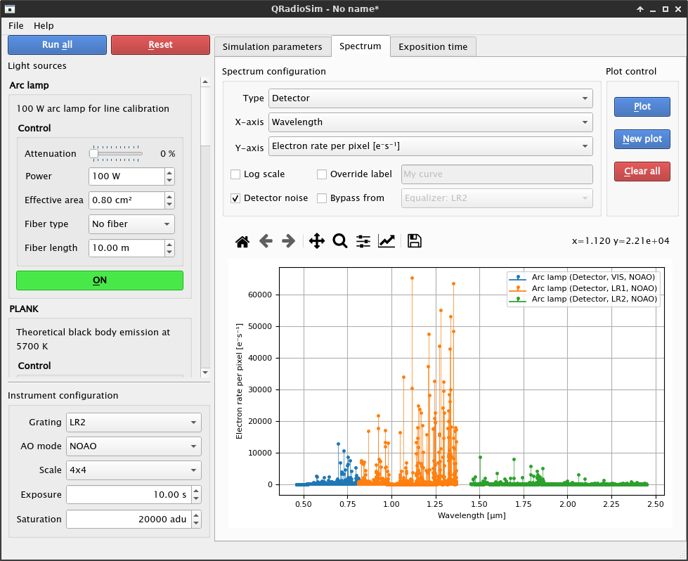

# RadioSim
The HARMONI's 1D Radiometric Simulator.



## Getting the code
This is a work in progress. If you want to retrieve the latest changes in the project, clone directly from the development branch (`develop`) as:

```
$ git clone --branch develop git@github.com:HARMONI-CAB/radiosim.git
$ cd radiosim
```

Or, if you have already cloned the repository, just fetch and switch the branch:

```
$ cd radiosim
$ git fetch origin develop
$ git checkout develop
$ git pull origin develop
```

## Installing dependencies
All dependencies are stored in `requirements.txt`. You can install them automatically with:

```
$ pip3 install -r requirements.txt
```

## Running
RadioSim's GUI can be launched from the command line with:
```
$ python3 qradiosim.py
```
